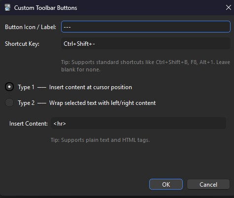
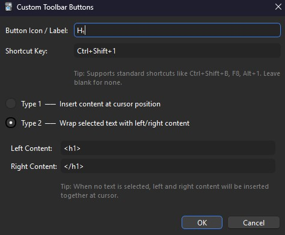

# Custom-Toolbar-Buttons-Anki
This Add-on adds a + button to the toolbar on the card editing page. Click it to insert a custom button to its left. Available button functions:
- Insert specified content at the cursor position
  For example for a line (horizontal rule):
  
  
- Insert content to the left and right of selected text
  For example for a H₁-Button:
  

Also added support for custom shortcuts.

Note: this is a fixed version of 457467704 on ankiweb.net, in addition I translated the add-on text to english and added support for darkmode on anki. I also added a shortcut option. 

